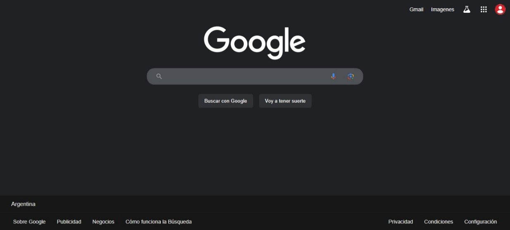
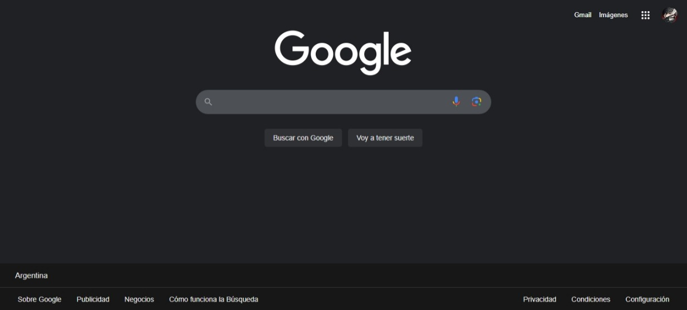

# Google home page clone (Frontend)

Just a frontend clone of google home page. 
The website it's entirely created with HTML and CSS except the cross icon appearing/disappearing of the search bar because his logic is handled in JavaScript.

## Clone Version

Fronted features (all of the original website): 
* on hover and focus animations
* on input cross appearing/disappearing
* transitions

## Original Version

<b>Disclaimer</b> None of the images and vectors used in the website are of my property.

